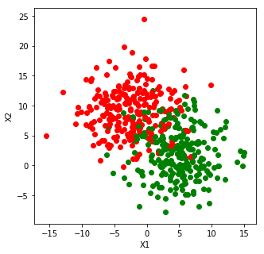
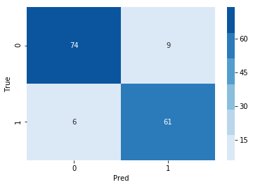
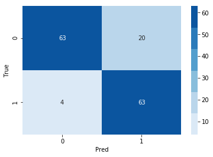
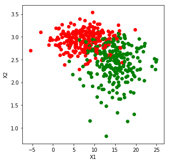

### Questions
- Level up at end of lab
    - How does scaling affect KNN?

### Objectives
YWBAT 
* code KNN using sklearn
* evaluate it using a confusion matrix
* apply evaluation metrics to a KNN model
* explain use cases for different evaluation metrics

### Outline
- List Objectives
- Take Questions
- Use Sklearn KNN
- Plot Confusion Matrix
- Discuss Various Metrics
- Write 3-5 sentences on what you learned.


```python
import pandas as pd
import numpy as np

from sklearn.metrics import confusion_matrix, r2_score, recall_score, f1_score, precision_score, accuracy_score
from sklearn.neighbors import KNeighborsClassifier, NearestNeighbors
from sklearn.datasets import make_blobs
from sklearn.model_selection import train_test_split

import matplotlib.pyplot as plt
import seaborn as sns

np.random.seed(42)
```


```python
# Distance Metrics
def minkowski(v1, v2, p):
    # distance metrics based on p
    # kth root of the sum of distances raised to the pth value
    distance = 0
    for i in range(len(v1)):
        distance += np.abs(v1[i]-v2[i])**p
    distance = np.power(distance, 1/p)
    return distance


def minkowski_np(v1, v2, p):
    sum_distance = np.sum(np.abs(v1 - v2)**p)
    distance = np.power(sum_distance, 1/p)
    return distance
```


```python
v1 = np.array([0, 0])
v2 = np.array([3, 4])
v3 = np.array([2, 4.5])
```


```python
minkowski(v1, v2, 1), minkowski_np(v1, v2, 1)
```


    (7.0, 7.0)


```python
for p in np.linspace(1, 5, 9):
    print("p = {}".format(p))
    # comparing d1 and d2
    print("d1 = {}".format(minkowski(v1, v2, p))) # is one always smaller
    print("d2 = {}".format(minkowski(v1, v3, p)))
    print("-"*20)
```

    p = 1.0
    d1 = 7.0
    d2 = 6.5
    --------------------
    p = 1.5
    d1 = 5.584250376480029
    d2 = 5.349937402825397
    --------------------
    p = 2.0
    d1 = 5.0
    d2 = 4.924428900898052
    --------------------
    p = 2.5
    d1 = 4.688140842343588
    d2 = 4.728278858112068
    --------------------
    p = 3.0
    d1 = 4.497941445275415
    d2 = 4.628011187371595
    --------------------
    p = 3.5
    d1 = 4.372215289689355
    d2 = 4.573727528347276
    --------------------
    p = 4.0
    d1 = 4.284572294953817
    d2 = 4.5432677064496225
    --------------------
    p = 4.5
    d1 = 4.221163518110637
    d2 = 4.52575314162099
    --------------------
    p = 5.0
    d1 = 4.174027662897746
    d2 = 4.515500227570816
    --------------------


### why is knowing that distance can change for various p important?
- to help pick the best p for the dataset


```python
data = make_blobs(n_samples=500, n_features=2, cluster_std=4.0, centers=2)
points, labels = data
```


```python
plt.figure(figsize=(5, 5))
color_dict = {0: 'r', 1: 'g'}
for p, l in zip(points, labels):
    plt.scatter(p[0], p[1], c=color_dict[l])
plt.xlabel("X1")
plt.ylabel("X2")
plt.show()
```





```python
xtrain, xtest, ytrain, ytest = train_test_split(points, labels, train_size=0.70)
```


```python
dlist = []
for p in np.linspace(1, 5, 9):
    for n in [2, 3, 4, 5, 6, 7]:
        d = {}
        print("p = {}, n = {}".format(p, n))
        d["p"] = p
        d["n"] = n
        knn = KNeighborsClassifier(n_neighbors=n, p=p)
        knn.fit(xtrain, ytrain)
        score = knn.score(xtest, ytest)
        print(score) # accuracy score
        d["score"] = score
        dlist.append(d)
        print("-"*50)
```

    p = 1.0, n = 2
    0.8866666666666667
    --------------------------------------------------
    p = 1.0, n = 3
    0.8733333333333333
    --------------------------------------------------
    p = 1.0, n = 4
    0.8933333333333333
    --------------------------------------------------
    p = 1.0, n = 5
    0.8733333333333333
    --------------------------------------------------
    p = 1.0, n = 6
    0.8866666666666667
    --------------------------------------------------
    p = 1.0, n = 7
    0.8933333333333333
    --------------------------------------------------
    p = 1.5, n = 2
    0.88
    --------------------------------------------------
    p = 1.5, n = 3
    0.88
    --------------------------------------------------
    p = 1.5, n = 4
    0.9066666666666666
    --------------------------------------------------
    p = 1.5, n = 5
    0.9
    --------------------------------------------------
    p = 1.5, n = 6
    0.8866666666666667
    --------------------------------------------------
    p = 1.5, n = 7
    0.8933333333333333
    --------------------------------------------------
    p = 2.0, n = 2
    0.88
    --------------------------------------------------
    p = 2.0, n = 3
    0.88
    --------------------------------------------------
    p = 2.0, n = 4
    0.9133333333333333
    --------------------------------------------------
    p = 2.0, n = 5
    0.8933333333333333
    --------------------------------------------------
    p = 2.0, n = 6
    0.9
    --------------------------------------------------
    p = 2.0, n = 7
    0.8933333333333333
    --------------------------------------------------
    p = 2.5, n = 2
    0.88
    --------------------------------------------------
    p = 2.5, n = 3
    0.8866666666666667
    --------------------------------------------------
    p = 2.5, n = 4
    0.9133333333333333
    --------------------------------------------------
    p = 2.5, n = 5
    0.88
    --------------------------------------------------
    p = 2.5, n = 6
    0.9066666666666666
    --------------------------------------------------
    p = 2.5, n = 7
    0.8933333333333333
    --------------------------------------------------
    p = 3.0, n = 2
    0.88
    --------------------------------------------------
    p = 3.0, n = 3
    0.8866666666666667
    --------------------------------------------------
    p = 3.0, n = 4
    0.9066666666666666
    --------------------------------------------------
    p = 3.0, n = 5
    0.88
    --------------------------------------------------
    p = 3.0, n = 6
    0.9066666666666666
    --------------------------------------------------
    p = 3.0, n = 7
    0.8933333333333333
    --------------------------------------------------
    p = 3.5, n = 2
    0.88
    --------------------------------------------------
    p = 3.5, n = 3
    0.8866666666666667
    --------------------------------------------------
    p = 3.5, n = 4
    0.9133333333333333
    --------------------------------------------------
    p = 3.5, n = 5
    0.88
    --------------------------------------------------
    p = 3.5, n = 6
    0.9
    --------------------------------------------------
    p = 3.5, n = 7
    0.8933333333333333
    --------------------------------------------------
    p = 4.0, n = 2
    0.8866666666666667
    --------------------------------------------------
    p = 4.0, n = 3
    0.88
    --------------------------------------------------
    p = 4.0, n = 4
    0.9066666666666666
    --------------------------------------------------
    p = 4.0, n = 5
    0.88
    --------------------------------------------------
    p = 4.0, n = 6
    0.9
    --------------------------------------------------
    p = 4.0, n = 7
    0.8933333333333333
    --------------------------------------------------
    p = 4.5, n = 2
    0.8866666666666667
    --------------------------------------------------
    p = 4.5, n = 3
    0.88
    --------------------------------------------------
    p = 4.5, n = 4
    0.9066666666666666
    --------------------------------------------------
    p = 4.5, n = 5
    0.88
    --------------------------------------------------
    p = 4.5, n = 6
    0.9
    --------------------------------------------------
    p = 4.5, n = 7
    0.8933333333333333
    --------------------------------------------------
    p = 5.0, n = 2
    0.8866666666666667
    --------------------------------------------------
    p = 5.0, n = 3
    0.88
    --------------------------------------------------
    p = 5.0, n = 4
    0.9066666666666666
    --------------------------------------------------
    p = 5.0, n = 5
    0.88
    --------------------------------------------------
    p = 5.0, n = 6
    0.9
    --------------------------------------------------
    p = 5.0, n = 7
    0.8933333333333333
    --------------------------------------------------


```python
dlist
```


    [{'p': 1.0, 'n': 2, 'score': 0.8866666666666667},
     {'p': 1.0, 'n': 3, 'score': 0.8733333333333333},
     {'p': 1.0, 'n': 4, 'score': 0.8933333333333333},
     {'p': 1.0, 'n': 5, 'score': 0.8733333333333333},
     {'p': 1.0, 'n': 6, 'score': 0.8866666666666667},
     {'p': 1.0, 'n': 7, 'score': 0.8933333333333333},
     {'p': 1.5, 'n': 2, 'score': 0.88},
     {'p': 1.5, 'n': 3, 'score': 0.88},
     {'p': 1.5, 'n': 4, 'score': 0.9066666666666666},
     {'p': 1.5, 'n': 5, 'score': 0.9},
     {'p': 1.5, 'n': 6, 'score': 0.8866666666666667},
     {'p': 1.5, 'n': 7, 'score': 0.8933333333333333},
     {'p': 2.0, 'n': 2, 'score': 0.88},
     {'p': 2.0, 'n': 3, 'score': 0.88},
     {'p': 2.0, 'n': 4, 'score': 0.9133333333333333},
     {'p': 2.0, 'n': 5, 'score': 0.8933333333333333},
     {'p': 2.0, 'n': 6, 'score': 0.9},
     {'p': 2.0, 'n': 7, 'score': 0.8933333333333333},
     {'p': 2.5, 'n': 2, 'score': 0.88},
     {'p': 2.5, 'n': 3, 'score': 0.8866666666666667},
     {'p': 2.5, 'n': 4, 'score': 0.9133333333333333},
     {'p': 2.5, 'n': 5, 'score': 0.88},
     {'p': 2.5, 'n': 6, 'score': 0.9066666666666666},
     {'p': 2.5, 'n': 7, 'score': 0.8933333333333333},
     {'p': 3.0, 'n': 2, 'score': 0.88},
     {'p': 3.0, 'n': 3, 'score': 0.8866666666666667},
     {'p': 3.0, 'n': 4, 'score': 0.9066666666666666},
     {'p': 3.0, 'n': 5, 'score': 0.88},
     {'p': 3.0, 'n': 6, 'score': 0.9066666666666666},
     {'p': 3.0, 'n': 7, 'score': 0.8933333333333333},
     {'p': 3.5, 'n': 2, 'score': 0.88},
     {'p': 3.5, 'n': 3, 'score': 0.8866666666666667},
     {'p': 3.5, 'n': 4, 'score': 0.9133333333333333},
     {'p': 3.5, 'n': 5, 'score': 0.88},
     {'p': 3.5, 'n': 6, 'score': 0.9},
     {'p': 3.5, 'n': 7, 'score': 0.8933333333333333},
     {'p': 4.0, 'n': 2, 'score': 0.8866666666666667},
     {'p': 4.0, 'n': 3, 'score': 0.88},
     {'p': 4.0, 'n': 4, 'score': 0.9066666666666666},
     {'p': 4.0, 'n': 5, 'score': 0.88},
     {'p': 4.0, 'n': 6, 'score': 0.9},
     {'p': 4.0, 'n': 7, 'score': 0.8933333333333333},
     {'p': 4.5, 'n': 2, 'score': 0.8866666666666667},
     {'p': 4.5, 'n': 3, 'score': 0.88},
     {'p': 4.5, 'n': 4, 'score': 0.9066666666666666},
     {'p': 4.5, 'n': 5, 'score': 0.88},
     {'p': 4.5, 'n': 6, 'score': 0.9},
     {'p': 4.5, 'n': 7, 'score': 0.8933333333333333},
     {'p': 5.0, 'n': 2, 'score': 0.8866666666666667},
     {'p': 5.0, 'n': 3, 'score': 0.88},
     {'p': 5.0, 'n': 4, 'score': 0.9066666666666666},
     {'p': 5.0, 'n': 5, 'score': 0.88},
     {'p': 5.0, 'n': 6, 'score': 0.9},
     {'p': 5.0, 'n': 7, 'score': 0.8933333333333333}]


```python
knn = KNeighborsClassifier(n_neighbors=5, p=1.5)
knn.fit(xtrain, ytrain)

# what does the 'fit' method do in KNN?
# just labels the points
```


    KNeighborsClassifier(algorithm='auto', leaf_size=30, metric='minkowski',
                         metric_params=None, n_jobs=None, n_neighbors=5, p=1.5,
                         weights='uniform')


```python
knn.score(xtest, ytest)
```


    0.9


```python
# plot a confusion matrix
ytest_pred = knn.predict(xtest)
cm = confusion_matrix(ytest, ytest_pred)
```


```python
sns.heatmap(cm, annot=True, cmap=sns.color_palette('Blues'))
plt.xlabel("Pred")
plt.ylabel("True")
plt.show()
```





### how do we evaluate?

#### Precision

$$\frac{TP}{TP+FP}$$

When do we use precision?
- When we want to lower False Positive Rate
- Credit Checks 
- Life Vest Safety
- Safety Metrics (Life Vest, Air bags, seat belts, car seats, laundry soap, cabinet locks, ....)
- Quality Assurance
- Don't mind False Negatives

#### Accuracy

$$\frac{TP+TN}{\sum}$$

- When do we use accuracy?
- Spam Mail
    - It's better to send email to junk than miss an important email

#### Recall 
$$\frac{TP}{TP+FN}$$

When do we use precision?
- When we want to lower False Negative Rate
- Disease/Cancer/Medical/Sickness...
- Don't mind False Positives


#### F1 - Harmonic Mean

$$\frac{2\times P \times R}{P + R}$$

When do we use F1?
- When we want to lower FP and FN

### How do we make a threshold?


```python
probs = knn.predict_proba(xtest)
probs[:3]
```


    array([[1. , 0. ],
           [0.2, 0.8],
           [1. , 0. ]])


```python
def get_labels(knn, xtest, thresh=0.5):
    probs = knn.predict_proba(xtest)
    labels = []
    for scores in probs:
        if scores[1] >= thresh:
            labels.append(1)
        else:
            labels.append(0)
    return np.array(labels)
```


```python
ytest_preds = get_labels(knn, xtest, thresh=0.30)
cm = confusion_matrix(ytest, ytest_preds)
```


```python
sns.heatmap(cm, annot=True, cmap=sns.color_palette('Blues'))
plt.xlabel("Pred")
plt.ylabel("True")
plt.show()
```





### Assessment/What did we learn?


```python
col0 = data[0][:, 0]+10
col1 = np.log(data[0][:, 1]+10)
new_data = np.column_stack([col0, col1])
new_data
```


    array([[ 5.57410543,  2.90535069],
           [ 1.43003813,  3.1979293 ],
           [ 3.5920757 ,  3.09840729],
           [ 6.97913201,  2.72077716],
           [10.84228328,  3.11363521],
           [ 1.35434569,  3.18324837],
           [ 4.75330084,  2.17311273],
           [15.73379408,  3.25946673],
           [12.20856286,  2.84127392],
           [12.95913157,  2.38379923],
           [ 3.06546248,  2.65531444],
           [21.30177661,  2.77450251],
           [12.14345739,  2.94734099],
           [10.74090567,  3.19619029],
           [15.79897826,  3.0093774 ],
           [18.57716843,  2.40849475],
           [16.06657873,  3.07037406],
           [17.1710063 ,  3.04718276],
           [10.78098203,  2.6483647 ],
           [13.25589553,  2.58556896],
           [11.54472204,  1.9451314 ],
           [ 7.74792245,  2.68807244],
           [ 7.67308974,  2.797762  ],
           [18.38259241,  2.83670079],
           [13.18542999,  2.46346058],
           [ 9.83823075,  3.32417625],
           [12.09033033,  2.81715784],
           [19.44473452,  2.33610383],
           [14.07067323,  2.89137914],
           [ 8.47066866,  2.8324197 ],
           [ 8.32625676,  2.41373333],
           [12.06209364,  3.09204278],
           [12.48084011,  2.18154121],
           [13.4087659 ,  2.55332599],
           [12.27030314,  2.14208842],
           [13.19601417,  2.81003436],
           [10.79246777,  3.10316525],
           [ 7.05576178,  3.02631642],
           [15.72170614,  2.46574228],
           [ 3.98832936,  2.6014361 ],
           [ 7.85784548,  2.40369754],
           [13.68408665,  2.12141268],
           [10.62331577,  2.18627366],
           [15.66399777,  2.76656648],
           [15.02436194,  2.31491561],
           [ 8.95719536,  2.72489204],
           [15.36734386,  2.56233456],
           [14.31127412,  2.79986051],
           [ 5.08824762,  2.88186407],
           [12.0889189 ,  2.28738839],
           [15.35068284,  1.89187509],
           [10.19757545,  2.94350441],
           [ 0.59113105,  2.81930149],
           [12.33732753,  2.52262053],
           [18.76725699,  1.79690093],
           [18.39301406,  2.2934425 ],
           [ 6.41317504,  3.08577657],
           [ 3.52865708,  2.81834424],
           [ 9.55099312,  3.53878921],
           [ 9.38375288,  2.92975114],
           [10.31565267,  2.78413315],
           [ 9.26207679,  2.11608223],
           [ 1.98012491,  2.72543068],
           [ 4.68259   ,  2.87377013],
           [ 2.75776833,  2.38484295],
           [ 9.26608009,  3.09615764],
           [ 9.77436442,  3.15940386],
           [ 7.77001072,  2.86065865],
           [ 6.49494578,  3.1311618 ],
           [16.61315044,  2.54258688],
           [ 9.00983206,  2.18176152],
           [24.88021699,  2.45005034],
           [14.25869671,  2.57179172],
           [13.6749346 ,  2.59386503],
           [ 4.35778921,  2.87503475],
           [ 9.63372114,  2.87628569],
           [12.68945394,  2.32658839],
           [ 9.14252819,  2.81895857],
           [17.48371871,  2.62105504],
           [ 4.21791964,  3.30995288],
           [ 8.3871723 ,  2.94783614],
           [ 7.3519553 ,  2.66302313],
           [15.7080799 ,  2.74288264],
           [12.85414438,  2.54549438],
           [14.37555964,  1.96418568],
           [13.83486964,  2.64354895],
           [16.27288986,  1.6414859 ],
           [ 7.20276189,  3.13672901],
           [10.74225085,  3.06957742],
           [11.39128131,  2.91376578],
           [21.83062494,  2.67666556],
           [ 4.45427173,  2.97633849],
           [14.57418725,  2.8170088 ],
           [14.28093606,  2.87546332],
           [11.34430689,  3.02846128],
           [ 7.9719849 ,  3.04794711],
           [ 8.93734648,  2.79934062],
           [15.30568767,  2.63497578],
           [ 7.94487176,  3.07559691],
           [ 8.28704116,  2.81021072],
           [19.31100708,  2.5642455 ],
           [19.42006535,  1.77162854],
           [ 3.95537263,  2.97701757],
           [11.19551257,  3.28286242],
           [13.67857724,  2.34888516],
           [ 4.62958754,  3.07881699],
           [10.55494757,  2.69507272],
           [ 4.18881359,  2.87518721],
           [ 4.13191501,  2.81040915],
           [20.1685148 ,  2.67882798],
           [18.79003861,  2.29587303],
           [14.47924703,  1.83259255],
           [15.99386447,  2.33331001],
           [16.01078022,  2.62468182],
           [20.84188081,  2.07690752],
           [14.75485813,  2.8383166 ],
           [ 5.69054049,  3.06831736],
           [ 6.59695124,  3.08512901],
           [12.12324587,  3.09923322],
           [ 4.69190034,  2.98922141],
           [10.98008492,  2.98303471],
           [20.32189583,  2.27111347],
           [ 3.63110853,  3.08000412],
           [15.38694589,  2.19183653],
           [ 7.06268094,  2.69956879],
           [ 9.7513676 ,  2.69632597],
           [20.90197495,  2.46045758],
           [19.4659147 ,  2.16394662],
           [15.87108591,  1.63559211],
           [11.20644772,  2.69289658],
           [22.16797682,  2.853872  ],
           [21.01262534,  2.29538997],
           [14.50113929,  2.55800442],
           [17.22181556,  3.02656156],
           [ 9.24713715,  2.70445883],
           [16.94816734,  2.4124245 ],
           [19.66290334,  2.12760538],
           [18.75650139,  2.62926379],
           [14.96901479,  2.78717502],
           [ 3.34181776,  2.90432569],
           [14.695596  ,  2.47457592],
           [16.12446233,  2.25729782],
           [15.09678943,  2.53166115],
           [10.94694585,  1.8819705 ],
           [ 4.0359996 ,  2.79356695],
           [11.15241085,  3.01206273],
           [ 6.72135852,  3.00669573],
           [ 8.53033355,  3.09745718],
           [ 0.63826426,  3.1958027 ],
           [16.97559158,  2.35479809],
           [ 9.02706417,  2.9382889 ],
           [ 9.20045427,  2.70525857],
           [ 8.34717735,  2.64129276],
           [ 8.30426754,  2.70903827],
           [ 5.70474257,  3.11083979],
           [20.42779037,  2.54626738],
           [14.98623799,  2.42925834],
           [ 7.96225771,  2.64947505],
           [15.67876884,  2.12296826],
           [17.47088658,  2.27452533],
           [ 8.91886432,  2.78764036],
           [ 8.78746779,  2.91743089],
           [ 6.2297254 ,  3.09331999],
           [ 6.65831338,  2.83569746],
           [19.23697214,  2.21489683],
           [15.42596352,  2.69524758],
           [18.00245303,  2.23673091],
           [12.80243524,  2.14871013],
           [ 4.13393228,  2.87793005],
           [15.03554598,  2.98125789],
           [17.25734146,  2.46392396],
           [12.90189393,  2.3736474 ],
           [ 2.72558839,  3.07456659],
           [ 8.9363848 ,  3.22551106],
           [ 8.41336214,  2.6670344 ],
           [14.83396535,  2.1574864 ],
           [-1.00478052,  2.82798003],
           [10.74487125,  2.64552415],
           [15.17175753,  2.2162302 ],
           [ 6.84565953,  3.02677006],
           [-2.98817804,  3.1046717 ],
           [22.02642682,  2.04028881],
           [14.75315234,  2.49256014],
           [ 2.44726656,  3.12173627],
           [11.78849571,  2.517607  ],
           [ 8.67528349,  2.99865336],
           [14.35921599,  1.67322477],
           [12.54179777,  2.63409274],
           [11.73133013,  2.39635729],
           [15.72619419,  1.92660724],
           [17.01228387,  2.37350793],
           [14.55261934,  3.02695052],
           [14.50886576,  2.28232836],
           [ 5.92236976,  2.57719912],
           [ 1.06086944,  2.98329635],
           [15.1522965 ,  2.22451144],
           [17.27405593,  2.99643142],
           [ 5.37176156,  3.04772473],
           [ 7.43681348,  2.6935078 ],
           [17.16950979,  2.76401378],
           [18.90657759,  2.81243136],
           [13.97140651,  2.53051911],
           [12.54898675,  2.78310861],
           [11.93430963,  2.95370807],
           [ 9.6791919 ,  2.9017246 ],
           [ 6.62007756,  3.15313737],
           [24.74760854,  2.28744045],
           [17.92180756,  2.63921916],
           [12.33279351,  2.70769911],
           [16.35835171,  2.54975141],
           [ 7.5112562 ,  2.89458164],
           [ 2.54299953,  2.61976235],
           [ 7.15671115,  2.35774689],
           [ 7.18239554,  3.01449976],
           [16.91894796,  2.62205677],
           [13.35339745,  2.89652948],
           [ 8.73443264,  3.21549857],
           [ 3.89714369,  3.04366316],
           [ 8.49277378,  3.01553877],
           [14.00784724,  2.32880292],
           [10.23584314,  2.53078963],
           [ 7.51177718,  2.9550253 ],
           [ 8.92195182,  3.05670621],
           [ 5.31327148,  2.96825709],
           [17.95750116,  1.14059471],
           [15.03720806,  2.70663041],
           [ 1.69846501,  2.59409217],
           [13.65690658,  2.38713536],
           [ 7.24008599,  3.12828811],
           [ 1.82931941,  2.85253747],
           [17.98264728,  2.00879672],
           [24.42288675,  2.52493268],
           [12.85786875,  2.87845141],
           [13.10197962,  2.59576815],
           [16.21768741,  2.33109789],
           [ 4.17482233,  2.81980395],
           [ 4.4653994 ,  2.58966233],
           [ 7.45891181,  3.21623485],
           [18.12437765,  2.36734942],
           [ 3.24158752,  3.04016323],
           [ 8.61476985,  2.80478289],
           [12.43098666,  2.67448631],
           [11.19822538,  2.34516051],
           [ 1.11309174,  2.81041339],
           [-0.18428248,  2.93959731],
           [ 6.43217504,  3.39769   ],
           [16.56391576,  2.55479846],
           [ 4.77070349,  2.99289329],
           [16.74943664,  2.44627196],
           [ 6.50924991,  2.77254756],
           [ 8.86527554,  2.48174545],
           [ 5.36879779,  2.81606797],
           [16.02293588,  2.41644354],
           [16.11457207,  2.34178796],
           [ 5.3697719 ,  2.76271481],
           [13.60151343,  1.78517079],
           [10.4446687 ,  2.98060642],
           [11.9893838 ,  2.65714731],
           [14.02044759,  2.58729179],
           [ 9.55094345,  3.04782317],
           [ 7.72363725,  2.67016867],
           [11.31045654,  2.62892271],
           [14.95390042,  3.04020924],
           [13.29674004,  2.92580624],
           [ 8.53777815,  2.21980519],
           [ 7.41473755,  2.70832807],
           [ 9.99347177,  2.746351  ],
           [ 4.20192079,  2.99518387],
           [17.93256117,  2.5068672 ],
           [ 9.57856864,  3.00579274],
           [ 7.88940784,  2.8332359 ],
           [ 8.85782628,  3.27786031],
           [15.79655341,  3.08165169],
           [ 3.20723238,  3.0418606 ],
           [ 8.40064212,  3.18812202],
           [ 8.52100394,  2.92940562],
           [ 6.883662  ,  3.06187365],
           [12.40419145,  2.60135674],
           [13.71614072,  2.69178498],
           [ 8.66309227,  2.78234599],
           [ 9.94746918,  3.09305483],
           [ 3.56476777,  3.03796288],
           [11.61480047,  3.12409939],
           [14.87840032,  2.2391577 ],
           [ 4.56933585,  2.98972026],
           [ 0.67727262,  2.93343632],
           [ 3.85233226,  2.46436292],
           [11.29249773,  2.81580813],
           [17.52656709,  2.00914817],
           [ 8.59756557,  3.10561839],
           [ 8.45865146,  2.43020097],
           [10.21861426,  2.87769278],
           [15.94441093,  1.9414309 ],
           [ 3.78308049,  2.9325893 ],
           [15.7833404 ,  2.58859052],
           [ 6.39059559,  2.28305578],
           [15.40427511,  2.49806272],
           [ 7.407196  ,  2.96957286],
           [14.92614379,  2.30881961],
           [10.6333988 ,  2.38405157],
           [ 7.58884307,  3.04482141],
           [ 5.43533471,  2.69310115],
           [ 6.61211483,  3.01762763],
           [13.29537681,  3.12901105],
           [22.03570322,  2.80211292],
           [14.00526456,  2.60223627],
           [ 1.41332251,  2.83775301],
           [17.6678333 ,  2.11438731],
           [12.34523081,  2.2809256 ],
           [13.50023059,  2.96065755],
           [ 4.90451084,  2.68703724],
           [10.25137834,  2.85701053],
           [13.65116931,  2.22410803],
           [15.61508169,  2.27386202],
           [ 8.82005842,  2.77385916],
           [ 9.56818843,  3.22466869],
           [ 3.46673285,  2.65024676],
           [17.36744479,  2.96320903],
           [ 7.80027561,  2.74529135],
           [ 7.032643  ,  3.17661744],
           [14.50737094,  2.95237588],
           [15.63741357,  2.90597073],
           [ 7.27638191,  1.92495815],
           [15.94758833,  2.40665386],
           [17.07146488,  2.5431446 ],
           [14.442024  ,  2.68597143],
           [10.14899075,  2.60289771],
           [12.19380762,  1.84790747],
           [10.77197426,  2.46660046],
           [ 5.54934819,  2.96226766],
           [13.93208993,  2.17247421],
           [12.71271761,  2.9495994 ],
           [17.00249816,  2.79776805],
           [ 7.87911257,  3.1306506 ],
           [ 9.51075149,  3.11250622],
           [20.82989964,  2.9526515 ],
           [ 7.79402061,  2.79151102],
           [20.23730058,  2.75185682],
           [10.92144087,  2.91096558],
           [ 4.39950152,  2.89408772],
           [ 2.68961675,  2.87222369],
           [14.71355235,  2.92739556],
           [ 1.28814865,  2.95951103],
           [14.86277849,  2.79422397],
           [ 6.55418888,  2.89468125],
           [ 5.60664915,  2.99285242],
           [12.35516288,  2.65770388],
           [15.99028948,  2.33463224],
           [ 5.73062443,  2.97232282],
           [16.64354759,  2.08727933],
           [15.45157092,  1.77667853],
           [12.18872407,  2.34395383],
           [12.03253441,  2.49837918],
           [ 9.12260192,  2.20270393],
           [12.12518469,  2.75566869],
           [16.75909555,  2.87579064],
           [ 4.84365652,  3.11013268],
           [ 2.20986955,  3.2710933 ],
           [ 7.7609152 ,  2.58891325],
           [15.58233707,  2.71181846],
           [ 7.52499784,  2.88799933],
           [ 8.84782323,  1.15623503],
           [ 7.44181529,  2.73600699],
           [11.58684221,  1.55891091],
           [15.34970291,  2.95258155],
           [ 9.98728165,  3.069339  ],
           [12.57072504,  2.86849869],
           [ 8.8158561 ,  3.13185572],
           [10.31562553,  2.66978827],
           [ 5.13334335,  3.10962752],
           [24.93331805,  2.50225884],
           [17.21076988,  2.85011556],
           [-5.47426698,  2.70248377],
           [12.8551451 ,  1.48500937],
           [ 7.04149018,  2.89759051],
           [17.12711869,  1.73910926],
           [14.62546868,  1.99329946],
           [10.59146134,  1.67779594],
           [20.65347204,  2.73971803],
           [ 4.25682797,  2.83364019],
           [13.56432407,  2.02115888],
           [12.14731673,  2.27739663],
           [10.73638582,  2.78425397],
           [13.80765364,  3.0948545 ],
           [19.62421961,  1.30280643],
           [14.45753477,  2.5608276 ],
           [12.8627058 ,  2.60138303],
           [ 9.51866124,  2.73845001],
           [ 1.0650171 ,  2.98710217],
           [11.82300735,  3.14542278],
           [ 3.85870607,  2.59264469],
           [ 6.4873807 ,  2.0720171 ],
           [12.46020249,  2.60784041],
           [ 3.54789819,  3.04597244],
           [ 1.57671442,  2.7809852 ],
           [13.40237856,  2.82974884],
           [ 2.17805818,  2.98576936],
           [ 9.79703023,  3.00861329],
           [12.68212107,  2.78190848],
           [18.66505007,  2.26857342],
           [15.97942716,  3.14174193],
           [13.58329869,  3.0525816 ],
           [16.10353221,  2.76913877],
           [16.71051492,  2.2049937 ],
           [12.56943364,  2.55476859],
           [16.55579814,  2.58835169],
           [ 8.12970908,  2.49860486],
           [13.26912846,  2.35017513],
           [ 3.81310544,  3.22740034],
           [ 5.27620516,  2.65484452],
           [15.48394871,  2.44982485],
           [-0.60976797,  2.98366492],
           [ 1.89653208,  3.05711722],
           [11.30680943,  3.07361193],
           [ 8.18352608,  3.02313125],
           [ 7.41674983,  2.88254407],
           [ 6.11994431,  2.76033755],
           [12.60146196,  2.81229012],
           [ 7.02820925,  2.87975287],
           [14.49992487,  2.94740155],
           [15.42325986,  2.08687368],
           [-0.77896602,  2.92626461],
           [ 5.63713161,  2.84207789],
           [17.9612221 ,  2.14579494],
           [13.89239226,  2.32378336],
           [ 8.78713825,  2.8607116 ],
           [ 7.87878624,  3.06315324],
           [11.72450032,  2.48318251],
           [11.82250407,  1.84677222],
           [15.75975334,  2.01105744],
           [13.61996997,  2.88976833],
           [16.87904063,  2.79093763],
           [ 6.3121612 ,  2.93167338],
           [13.69541028,  2.96923349],
           [ 4.1036275 ,  2.56147388],
           [ 7.34749822,  3.22973112],
           [12.41908073,  2.97030153],
           [ 3.22032066,  2.91478076],
           [20.95816742,  2.29068755],
           [ 6.48052977,  2.64070978],
           [10.65493017,  2.73285574],
           [15.32334059,  2.41923294],
           [10.68145956,  2.43973685],
           [ 9.51816143,  2.94403608],
           [ 7.83899065,  2.88022359],
           [10.4799768 ,  3.06599348],
           [10.07230618,  3.19821637],
           [15.52841392,  2.30838576],
           [10.77904302,  3.28096603],
           [18.11830252,  2.85622426],
           [15.07745801,  2.69976505],
           [ 8.72553385,  2.80627648],
           [ 7.88150677,  2.76771731],
           [11.47798101,  2.62893795],
           [ 4.32071942,  2.92075764],
           [ 2.27292437,  3.07698854],
           [17.97556745,  2.625385  ],
           [ 4.61702549,  2.89924877],
           [14.48934003,  2.79645033],
           [19.80632561,  3.15668487],
           [ 7.73172322,  3.36270789],
           [11.08920188,  3.00783297],
           [ 5.59102113,  2.79734043],
           [14.23936892,  3.115329  ],
           [16.29361845,  2.96940642],
           [ 4.78311438,  3.06623693],
           [14.48165822,  2.6877912 ],
           [17.24068355,  2.44897426],
           [ 7.54280994,  3.21198906],
           [ 2.88682807,  3.02125762],
           [16.39993664,  2.29907422],
           [12.83065356,  0.82314525],
           [ 5.08397593,  3.27424994],
           [14.71361457,  2.59252685],
           [16.25001411,  2.75881258],
           [13.5603791 ,  2.08667964],
           [12.55844697,  2.78399889],
           [ 5.61290483,  3.05327102],
           [17.78307947,  2.61556934],
           [23.83547133,  2.35345076],
           [ 5.64824729,  3.14599433],
           [ 7.87002032,  2.89543508],
           [16.16067024,  2.6683049 ],
           [14.34214512,  2.67109974],
           [12.20799111,  2.95929441],
           [13.75602214,  2.49161022],
           [18.93440584,  2.06269059],
           [ 3.4394779 ,  3.00920488],
           [12.13201061,  2.9561056 ],
           [12.03730856,  2.30504887],
           [ 5.60307491,  3.15145694],
           [15.47341007,  1.33663925],
           [ 3.93274466,  2.75690671],
           [ 9.48003524,  1.91587126],
           [18.33598691,  2.41890583],
           [ 8.78167662,  2.75400221],
           [15.43221788,  2.43323855],
           [17.19424867,  1.67280502],
           [10.33726189,  2.67523205],
           [12.14060453,  2.49134702]])


```python
plt.figure(figsize=(5, 5))
color_dict = {0: 'r', 1: 'g'}
for p, l in zip(new_data, labels):
    plt.scatter(p[0], p[1], c=color_dict[l])
plt.xlabel("X1")
plt.ylabel("X2")
plt.show()
```





```python
xtrain, xtest, ytrain, ytest = train_test_split(new_data, labels, train_size=0.70)
```


```python
knn = KNeighborsClassifier()
knn.fit(xtrain, ytrain)
```


    KNeighborsClassifier(algorithm='auto', leaf_size=30, metric='minkowski',
                         metric_params=None, n_jobs=None, n_neighbors=5, p=2,
                         weights='uniform')


```python
knn.score(xtest, ytest)
```


    0.8866666666666667


```python

```
